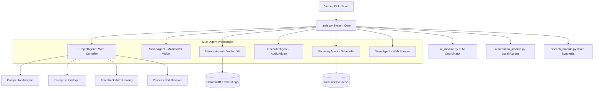

# 🤖 JARVIS: Advanced Agentic AI Desktop Assistant

> **Status: Operational // Port 5000: Clean // Systems: Nominal**
>
> Welcome to the official repository of **JARVIS** (Just Another Rather Very Intelligent System)—a state-of-the-art, voice-activated, multi-agent desktop companion built to automate full-stack web engineering, workspace environments, real-time research, and computer-vision telemetry.

---

## 🌟 Key Capabilities

### 1. 🌐 The Agile Web Compiler (`ProjectAgent`)
JARVIS features an industrial-grade website builder that builds, seeds, compiles, and tests full-stack Flask applications from single verbal descriptions.
* **Competitor Trend Analysis**: Searches live web listings via DuckDuckGo and utilizes Gemini to extract modern UX/UI trends.
* **Enterprise blueprints Codegen**: Generates beautiful, responsive frontend layouts (using Tailwind CSS CDN and FontAwesome icons) and structured Flask Application Factory backend blueprints with dynamic database seeding.
* **Traceback-Aware Self-Healing**: Automatically reads traceback files upon startup crashes, feeds the actual implicated files to Gemini, and applies surgical JSON patches to resolve database, blueprint, or routing bugs on the fly.
* **High-Speed Connection Reclaiming**: Employs system-wide TCP scanning (`psutil.net_connections`) to immediately clear Port 5000, killing parent processes and orphan subprocess trees in milliseconds to guarantee clean boots.

### 2. 👁️ System Vision Core (`VisionAgent`)
* The visual senses of JARVIS. Allows real-time screen captures combined with multimodal Gemini processing.
* Can inspect UI layouts, debug visually, read text on screens, and describe your active workspace environment.

### 3. 🧠 Long-Term Semantic Memory (`MemoryAgent`)
* Powered by **ChromaDB** and the **SentenceTransformers** vector embedding models (`all-MiniLM-L6-v2`).
* Remembers user preferences, past commands, and custom contextual requirements, retrieving them semantically during active tasks. Includes a safe import wrapper that prevents PyTorch DLL loader locks under Windows.

### 4. 🎙️ High-Fidelity Recording Suite (`RecorderAgent`)
* **Audio Capture**: Record micro-level high-quality WAV files using PyAudio.
* **Video Capture**: Capture standard webcam video feeds using OpenCV.
* **Screen Recording**: Record high-fps screen layouts into compressed AVI videos utilizing PIL and OpenCV.

### 5. 📅 Scheduling & Reminders (`SecretaryAgent`)
* Keeps a local, JSON-backed persistent reminders database. Run in a background thread to deliver desktop alerts at exact target minutes.

### 6. 📰 Live Tech News Anchor (`NewsAgent`)
* Aggregates real-time news articles and summarizes headlines using Gemini in the voice of a professional tech news anchor.

---

## 📐 System Architecture

The following diagram illustrates how the individual modules and core agent classes interact under the JARVIS ecosystem:



---

## 🗣️ Supported Commands Directory

Below are the default voice/CLI triggers mapped to their corresponding backend services:

| Commands Trigger Category | Verbal / Written Pattern Examples | Core Module Executed | Action Description |
| :--- | :--- | :--- | :--- |
| **Full-Stack Build** | `"build website about coffee shop"`, `"create website for gym"` | `ProjectAgent` | Runs market research, compiles full-stack Flask/Tailwind pages, seeds database, and opens live local preview on Port 5000. |
| **Developer handoff** | `"push to github"`, `"deploy project to github"` | `ProjectAgent` | Creates a secure private repository on GitHub, commits all codebase files, and pushes changes using your encrypted credentials. |
| **Cloud database** | `"migrate database to postgres"`, `"connect to cloud db"` | `ProjectAgent` | Reconfigures SQLite connection strings to remote cloud URIs dynamically. |
| **System Vision** | `"what is on my screen"`, `"inspect layout"` | `VisionAgent` | Takes screen capture and runs visual Gemini analysis. |
| **Semantic Recall** | `"remember that I prefer dark mode"`, `"recall preferences"` | `MemoryAgent` | Writes or reads semantic memories inside vector databases. |
| **Workspace Control** | `"open chrome"`, `"launch visual studio"`, `"search for python"` | `AutomationAgent` | Automatically spawns local desktop tools or opens browser queries. |
| **Recording Engine** | `"start screen recording"`, `"record audio"`, `"stop recording"` | `RecorderAgent` | Records audio, webcam video, or screen configurations. |
| **News Summaries** | `"what is the tech news"`, `"summarize technology trends"` | `NewsAgent` | Scrapes DuckDuckGo and recites summarized technology headlines. |
| **Reminders** | `"set a reminder for 14:30 to join meeting"`, `"check alerts"` | `SecretaryAgent` | Manages local scheduler reminders databases. |

---

## 🚀 Getting Started

### 📋 Prerequisites
Ensure your local machine has the following packages installed:
* Python 3.10+
* Git
* FFmpeg (if recording video/audio)
* SQLite3

### 🔧 Installation
1. **Clone the Repository**:
   ```bash
   git clone https://github.com/<your-username>/JARVIS.git
   cd JARVIS
   ```

2. **Configure Virtual Environment**:
   ```bash
   python -m venv .venv
   .venv\Scripts\activate   # On Windows
   source .venv/bin/activate  # On Linux/macOS
   ```

3. **Install Dependencies**:
   ```bash
   pip install -r requirements.txt
   ```

4. **Initialize Environment Variables**:
   Create a `.env` file in the root directory:
   ```env
   GEMINI_API_KEY=your_gemini_api_key
   GITHUB_TOKEN=your_github_personal_access_token
   OWNER_NAME=BOSS
   EMAIL_USER=your_email@gmail.com
   EMAIL_PASS=your_email_app_password
   ```

5. **Start JARVIS**:
   ```bash
   python jarvis.py
   ```

---

## 🛡️ License & Safety Protocol
JARVIS is configured with a restricted security wrapper inside the `GeneralistAgent` and `ProjectAgent` classes. Local command executions, workspace modifications, and GitHub operations are bound to your user directory (`Desktop/jarvis documents` and designated workspace paths) to prevent accidental directory overwrites or OS file deletions.

*Created autonomously with 🧠 by JARVIS.*
