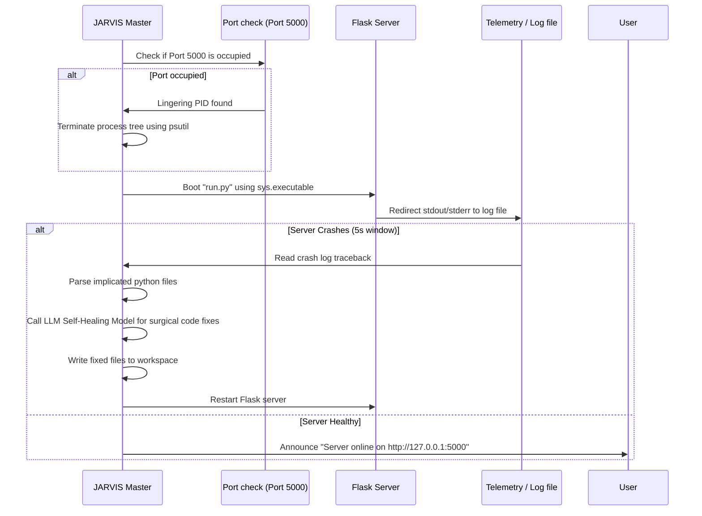

<div align="center">
  <h1>🤖 JARVIS v3.0</h1>
  <p><strong>A Next-Generation Autonomous Voice Assistant, Web Designer & Multi-Agent Orchestrator</strong></p>

  [](https://www.python.org/)
  [](https://github.com/joaomdmoura/crewAI)
  [](https://ollama.com/)
  [](https://deepmind.google/technologies/gemini/)
  [](LICENSE)
</div>

---

JARVIS is a next-generation local AI orchestrator. It functions as an intelligent desktop assistant with voice control, persistent semantic memory, computer vision, and local operating system automation. 

Furthermore, JARVIS is integrated with a **CrewAI Software Engineering Department** and a **Local Single-page Web Designer** capable of parsing, styling, and writing code directly to your local environment.

---

## 📐 System Architecture

JARVIS leverages a dual-path code generation pipeline and a self-healing local Flask execution controller:

### 1. Dual-Path Code Generation Pipeline
This flowchart illustrates how triggers distinguish between the local single-page visual generator and the multi-agent CrewAI software factory, applying style randomizations, and compiling outputs inside the `PROJECTS` directory:


### 2. Self-Healing & Port-Clearing Process
During full-stack development, JARVIS handles occupied port conflicts, reads stderr logs from Werkzeug reloaders, and performs surgical self-healing LLM patches to recover from circular imports or DB schema updates:



---

## 🌟 Key Features

### 🏢 Multi-Agent Software Factory (CrewAI Integration)
By saying *"Jarvis, build a website..."*, JARVIS launches an isolated background thread that controls a multi-agent developer crew:
* **Product Manager**: Analyzes competitor trends using live search engines and drafts a Software Requirements Specification (SRS) mapping features and user flows.
* **Senior Software Engineer**: Translates the SRS into raw Python Flask backend frameworks, SQL Alchemy database configurations, and Tailwind CSS templates.
* **QA Auditor**: Scans file syntax and fixes circular import bugs.
* **Real-time Status Voiceover**: JARVIS speaks phase updates in real time (PM trends check, coder file writing, QA reviews) along with time-throttled micro-reporting logs, ensuring you know exactly what is happening under the hood.

### 🎨 Visual Theme Randomization
To guarantee no two website or webpage builds look identical, JARVIS applies dynamic design constraints:
* **Webpages**: Selects randomly from 5 pre-made responsive stylesheet classes (Stark Industries, Cyberpunk Grid, Minimalist Obsidian, Emerald Matrix, Synthwave Sunset) and spawns interactive decorative elements.
* **Websites**: Injects dynamic aesthetic guidelines (Neo-Brutalism, Glassmorphism, Cozy Pastels, Retro Synthwave, Obsidian Minimalist, etc.) into the AI code generator prompts and PM specifications, forcing custom color palettes and typography scales.

### 🗣️ Multilingual Voice & Dynamic Language Routing
* **Telugu Voice Detection & Auto-Translation**: Automatically detects Telugu script (`[\u0C00-\u0C7F]`) in user voice commands, dynamically switching the TTS voice engine to the localized Telugu voice (`te-IN-MohanNeural`).
* **Bidirectional Speech Translation**: Integrates robust translation pipelines to translate incoming Telugu speech commands into structured English instructions for JARVIS's intent router, and then translate the English response back to natural conversational Telugu script before speaking.
* **Dynamic Language Switcher**: Supports voice triggers such as *"speak in telugu"*, *"speak in hindi"*, etc., dynamically remapping voices to appropriate regional neural voice models (supporting Telugu, Hindi, Bengali, Tamil, Kannada, Malayalam, Marathi, Urdu, Gujarati, and English).

### 🌐 Local-First Architecture with Cloud Fallbacks (Ollama, Gemini & ChatGPT)
* **Local Ollama as Primary Brain**: To prevent API rate-limits and cloud dependency, JARVIS uses local Ollama as the primary provider for both general conversation and software coding tasks.
* **Conversational Fallback Chain**: If local Ollama is offline or returns an error during a general conversation query, JARVIS gracefully falls back to:
  1. **Google Gemini Key Pool**: Auto-rotates between a pool of API keys (configured via a comma-separated list under `GEMINI_API_KEY`).
  2. **ChatGPT Fallback**: If the Gemini pool is exhausted, it falls back to OpenAI's `gpt-4o-mini` (fast, token-capped direct REST payload).
* **Strict Offline Coding (Safety & Rate-Limit Shield)**: Software development, code generation, and CrewAI website builds are routed **strictly** to the local Ollama coding model (`qwen2.5-coder:7b` or as configured via `OLLAMA_CODING_MODEL`). To prevent cloud quota consumption and enforce codebase privacy, coding tasks are **never** allowed to fallback to cloud APIs.
* **Self-Healing Auto-Start**: If the local Ollama server is offline when requested, JARVIS automatically locates and launches the `ollama.exe` server in the background (hidden window) and polls the port (`11434`) for up to 15 seconds to ensure it is fully initialized before proceeding.
* **Bypass Key Rotation**: When completely offline, JARVIS detects network/DNS connection errors and immediately bypasses Gemini key rotation to prevent terminal log clutter, relying entirely on the local brain.
* **Offline Standby Controls**: System level overrides (like *"go to sleep"* or *"standby"*) bypass both local and cloud LLMs entirely, ensuring immediate execution.

### 🧠 Persistent Vector Memory (ChromaDB)
When commanded to *"Remember that..."*, JARVIS encodes the knowledge into vector embeddings using a local `SentenceTransformer` model and stores it inside ChromaDB. This permits semantic recall across desktop execution loops.

### 📹 Multi-Modal Recording Suite
Includes a background-threaded `RecorderAgent` capable of running video capture, audio recording, and screen captures on demand.

### 📨 Communication & Automation Controllers
* **Email Suite**: Drafts emails, launches file-picker dialogs for attachments, and sends them via SMTP SSL.
* **WhatsApp Linker**: Automatically targets numbers, encodes messages, and opens the native Windows WhatsApp app to send.

### ⚡ Performance, Diagnostics & Atomic Telemetry
* **Atomic Logs Database**: Employs atomic write transactions (`os.replace`) to prevent concurrency locks or JSON database corruption between the PyQt5 HUD threads, Proactive Monitor daemon, and the Streamlit dashboard server.
* **Fast Path Detection**: Dynamic `find_spec` scans bypass slow subprocess checks for optional heavy dependencies (e.g. PyTorch, ChromaDB, Silero VAD) on environments where they are not installed, maintaining instant start times.
* **API Key Pool Diagnostics**: Includes `fix_my_key.py` to recursively test connectivity, listing active generative model access scopes for each key in `config.API_KEYS_POOL`.

### 👤 Dynamic Operator Persona & Self-Improvement (Cognitive Engine)
* **Silent Self-Learning & Profile Tracking**: Analyzes conversational turns in the background to automatically classify the operator's style (brief, detailed, witty, formal, technical) and favorite topics (coding, shopping, system automation, etc.), persisting them silently to `memory.json`.
* **Complexity-Based Response Length Constraints**: Dynamically assesses query complexity. General chit-chat or simple facts are constrained to exactly 3–6 lines, while complex technical/programming queries are strictly restricted to less than 12 lines (max 11 lines total, excluding empty lines) using a post-generation compression or manual truncation step.
* **Streamlit HUD Persona Center**: Renders the detected operator style and a frequency chart of favorite topics on the STREAMLIT dashboard.
* **Vocal Persona & Identity Controls**:
  - *"tell me about yourself"* -> Speaks a butler-style introduction derived from codebase file scans and capabilities manual.
  - *"show my profile"* / *"who am i to you"* -> Speaks the operator style and favorite topics summary report.
  - Codebase structural self-awareness -> Answers questions about files, skill count, and capabilities manual dynamically.

### 🛍️ Indian Store Shopper Agent & Checkout Automation
* **Indian E-Commerce Target**: Suffixes search queries with `"price India"` and whitelists only Indian stores (`amazon.in`, `flipkart.com`, `croma.com`, `reliance-digital.in`, etc.).
* **Verified Safe Domain Filtering**: Filters website reputation using search and Gemini reviews analysis to exclude scam sites, formatting all prices in Rupees (Rs.).
* **Playwright Automated Checkout**: Automatically spawns a visible Playwright Chrome session, navigates to the cheapest verified retailer, adds the item to the cart, proceeds to checkout, and pauses at the payment screen for secure completion.

---

## 📂 Project Structure

```
assistent/
│
├── jarvis.py              # Main Orchestration Loop (The CEO)
├── jarvis_gui.py          # PyQt5 HUD Dashboard & User Interface Overlay
├── agent_module.py        # Workers: MemoryAgent, NewsAgent, ProjectAgent, BrowserAgent
├── ai_module.py           # Model Wrapper & Google GenAI API Router
├── speech_module.py       # SpeechRecognizer (optimized Voice ear)
├── automation_module.py   # Windows UI Automation (pywinauto, pyautogui)
├── contact_module.py      # Contact directory & phone/email lookups
├── config.py              # System Settings (DOTENV integration)
├── fix_my_key.py          # API Key Pools Diagnostics Tool
├── check_deps.py          # System Dependency Audit Script
├── wakeup_jarvis.bat      # Startup sequence bootloader
├── requirements.txt       # Project Dependencies
│
└── skills/                # 🔌 Plugin-based Dynamic Skills Engine
    ├── email_skill.py        # Secure SMTP Email & attachments
    ├── media_skill.py        # YouTube music & OS media controls
    ├── recorder_skill.py     # Video, audio, and screen recording
    └── whatsapp_skill.py     # WhatsApp Desktop messaging automation
```

### 🆕 Key Upgrades in Version 3.0
* **Plugin-based Dynamic Skills Architecture**: Heavy core modules extracted from `jarvis.py` into dynamically loaded skill plugins in `skills/`.
* **Zero-Lag Asynchronous Biometric Load**: Deferred SpeechBrain model loading and Pygame mixer initialization to background threads, dropping cold startup time significantly.
* **Import-Time Deadlock Prevention**: De-registered concurrent module imports at load-time to prevent PyQt5 and Pygame mixer thread deadlocks.
* **Global Regex Caching**: Cached compiled regular expression matching patterns for Indian scripts and user intents to save CPU cycles.


---

## 🚀 Setup & Installation

### Prerequisites
* **Windows OS**
* **Python 3.11** (recommended to match the virtual environment configuration)
* Google Gemini API Key

### Installation

1. **Clone the Repository:**
   ```powershell
   git clone https://github.com/jagadeesvarrao-design/JARVIS.git
   cd JARVIS
   ```

2. **Configure your Virtual Environment:**
   ```powershell
   python -m venv .venv
   .venv\Scripts\activate
   ```

3. **Install Requirements:**
   ```powershell
   pip install -r requirements.txt
   ```

4. **Setup Environment Variables:**
   Create a `.env` file in the root directory:
   ```env
   # Single or comma-separated list of Gemini API keys for auto-rotation
   GEMINI_API_KEY=first_key_here,second_key_here,third_key_here
   GITHUB_TOKEN=your_github_token_here
   EMAIL_USER=your_email@gmail.com
   EMAIL_PASS=your_gmail_app_password
   ```

5. **Advanced Configuration (config.py):**
   Open [config.py](file:///c:/Users/DELL/OneDrive/Desktop/assistent/config.py) to customize your AI model settings:
    * `CONVERSATION_PROVIDER`: Set to `"gemini"` to use the cloud Gemini pool as the primary conversational brain (falling back to local Ollama on failure), or `"ollama"` to use local Ollama as the primary brain.
   * `CODING_PROVIDER`: Set to `"ollama"` to route all coding and website generation tasks strictly to local Ollama (no cloud fallback allowed), or `"gemini"` for cloud-based code generation.
   * `OLLAMA_MODEL`: The local model used for general-purpose conversation (defaults to `"llama3:latest"`).
   * `OLLAMA_CODING_MODEL`: The local model used for coding tasks (defaults to `"qwen2.5-coder:7b"`).

6. **Start JARVIS:**
   ```powershell
   .\wakeup_jarvis.bat
   ```

---

## 🛡️ License
This project is licensed under the MIT License. See the [LICENSE](LICENSE) file for details.
