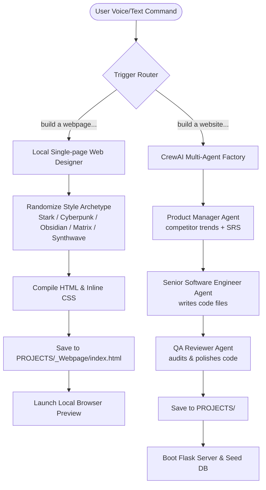

<div align="center">
  <h1>🤖 JARVIS</h1>
  <p><strong>A Next-Generation Autonomous Voice Assistant, Web Designer & Multi-Agent Orchestrator</strong></p>

  [](https://www.python.org/)
  [](https://github.com/joaomdmoura/crewAI)
  [](https://deepmind.google/technologies/gemini/)
  [](LICENSE)
</div>

---

JARVIS is a next-generation local AI orchestrator. It functions as an intelligent desktop assistant with voice control, persistent semantic memory, computer vision, and local operating system automation. 

Furthermore, JARVIS is integrated with a **CrewAI Software Engineering Department** and a **Local Single-page Web Designer** capable of parsing, styling, and writing code directly to your local environment.

---

## 📐 System Architecture

JARVIS leverages a dual-path code generation pipeline and a self-healing local Flask execution controller:

### 1. Dual-Path Code Generation Pipeline
This flowchart illustrates how triggers distinguish between the local single-page visual generator and the multi-agent CrewAI software factory, applying style randomizations, and compiling outputs inside the `PROJECTS` directory:



### 2. Self-Healing & Port-Clearing Process
During full-stack development, JARVIS handles occupied port conflicts, reads stderr logs from Werkzeug reloaders, and performs surgical self-healing LLM patches to recover from circular imports or DB schema updates:

```mermaid
sequenceDiagram
    participant J as JARVIS Master
    participant P as Port check (Port 5000)
    participant S as Flask Server
    participant L as Telemetry / Log file
    
    J->&gt;P: Check if Port 5000 is occupied
    alt Port occupied
        P->&gt;J: Lingering PID found
        J->&gt;J: Terminate process tree using psutil
    end
    J->&gt;S: Boot "run.py" using sys.executable
    S->&gt;L: Redirect stdout/stderr to log file
    alt Server Crashes (5s window)
        L->&gt;J: Read crash log traceback
        J->&gt;J: Parse implicated python files
        J->&gt;J: Call LLM Self-Healing Model for surgical code fixes
        J->&gt;J: Write fixed files to workspace
        J->&gt;S: Restart Flask server
    else Server Healthy
        J->&gt;User: Announce "Server online on http://127.0.0.1:5000"
    end
```

---

## 🌟 Key Features

### 🏢 Multi-Agent Software Factory (CrewAI Integration)
By saying *"Jarvis, build a website..."*, JARVIS launches an isolated background thread that controls a multi-agent developer crew:
* **Product Manager**: Analyzes competitor trends using live search engines and drafts a Software Requirements Specification (SRS) mapping features and user flows.
* **Senior Software Engineer**: Translates the SRS into raw Python Flask backend frameworks, SQL Alchemy database configurations, and Tailwind CSS templates.
* **QA Auditor**: Scans file syntax and fixes circular import bugs.
* **Real-time Status Voiceover**: JARVIS speaks phase updates in real time (PM trends check, coder file writing, QA reviews) along with time-throttled micro-reporting logs, ensuring you know exactly what is happening under the hood.

### 🎨 Visual Theme Randomization
To guarantee no two website or webpage builds look identical, JARVIS applies dynamic design constraints:
* **Webpages**: Selects randomly from 5 pre-made responsive stylesheet classes (Stark Industries, Cyberpunk Grid, Minimalist Obsidian, Emerald Matrix, Synthwave Sunset) and spawns interactive decorative elements.
* **Websites**: Injects dynamic aesthetic guidelines (Neo-Brutalism, Glassmorphism, Cozy Pastels, Retro Synthwave, Obsidian Minimalist, etc.) into the AI code generator prompts and PM specifications, forcing custom color palettes and typography scales.

### 🧠 Persistent Vector Memory (ChromaDB)
When commanded to *"Remember that..."*, JARVIS encodes the knowledge into vector embeddings using a local `SentenceTransformer` model and stores it inside ChromaDB. This permits semantic recall across desktop execution loops.

### 📹 Multi-Modal Recording Suite
Includes a background-threaded `RecorderAgent` capable of running video capture, audio recording, and screen captures on demand.

### 📨 Communication & Automation Controllers
* **Email Suite**: Drafts emails, launches file-picker dialogs for attachments, and sends them via SMTP SSL.
* **WhatsApp Linker**: Automatically targets numbers, encodes messages, and opens the native Windows WhatsApp app to send.

---

## 📂 Project Structure

```
assistent/
│
├── jarvis.py              # Main Orchestration Loop (The CEO)
├── agent_module.py        # Workers: MemoryAgent, NewsAgent, ProjectAgent, DocumentAgent
├── ai_module.py           # Model Wrapper & Google GenAI API Router
├── speech_module.py       # SpeechRecognition & Voice Inputs
├── automation_module.py   # Windows UI Automation (pyautogui & win32com)
├── contact_module.py      # Contact directory & phone/email lookups
├── config.py              # System Settings & API keys pool configuration
├── wakeup_jarvis.bat      # Startup sequence bootloader
└── requirements.txt       # Project Dependencies
```

---

## 🚀 Setup & Installation

### Prerequisites
* **Windows OS**
* **Python 3.11** (recommended to match the virtual environment configuration)
* Google Gemini API Key

### Installation

1. **Clone the Repository:**
   ```powershell
   git clone https://github.com/jagadeesvarrao-design/JARVIS.git
   cd JARVIS
   ```

2. **Configure your Virtual Environment:**
   ```powershell
   python -m venv .venv
   .venv\Scripts\activate
   ```

3. **Install Requirements:**
   ```powershell
   pip install -r requirements.txt
   ```

4. **Setup Environment Variables:**
   Create a `.env` file in the root directory:
   ```env
   GEMINI_API_KEY=your_gemini_key_here
   GITHUB_TOKEN=your_github_token_here
   EMAIL_USER=your_email@gmail.com
   EMAIL_PASS=your_gmail_app_password
   ```

5. **Start JARVIS:**
   ```powershell
   .\wakeup_jarvis.bat
   ```

---

## 🛡️ License
This project is licensed under the MIT License. See the [LICENSE](LICENSE) file for details.
